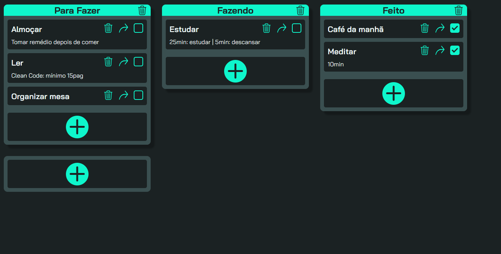

<h1>Introdução 📝</h1>

O "Simple To-Do" é um aplicativo web que ajuda o usuário a organizar suas tarefas pessoais de forma simples, com uma interface limpa e fácil de usar.

<h1>Ferramentas ⚙</h1>

    
    
    
    
    
    

O propósito desse projeto foi testar os meus conhecimentos em <i>TypeScript</i>, sendo assim, aproveitei para experimentar o <i>Vite</i>, uma <i>build tool</i> que nunca tinha utilizado antes.

<h1>Como Utiliza-lo 👨‍💻</h1>
<ol>
    <li>
        
No topo da raiz do repositório clique em 'code', e copie a url mostrada: <em>Code &gt HTTPS &gt Copy URL</em>

    </li>
    <li>
        
Com o auxílio do <em>GIT bash</em>, vá até o local que deseja inserir o clone do repositório;

    </li>
    <li>
        
Dentro do terminal execute o comando <code>git clone + URL</code>

    </li>
    <li>
        
Abra a pasta criada com o seu editor de texto de preferência. Ex: VScode, Sublime, Atom, etc.;

    </li>
    <li>
        
Na raiz da pasta, com <em>node.js</em> instalado, execute o comando: <code>npm install</code>

    </li>
    <li>
        
Ainda no terminal, execute o comando: <code>npm run dev</code>

    </li>
    <li>
        
Agora basta aproveitar a aplicação. 🤗

    </li>
</ol>

